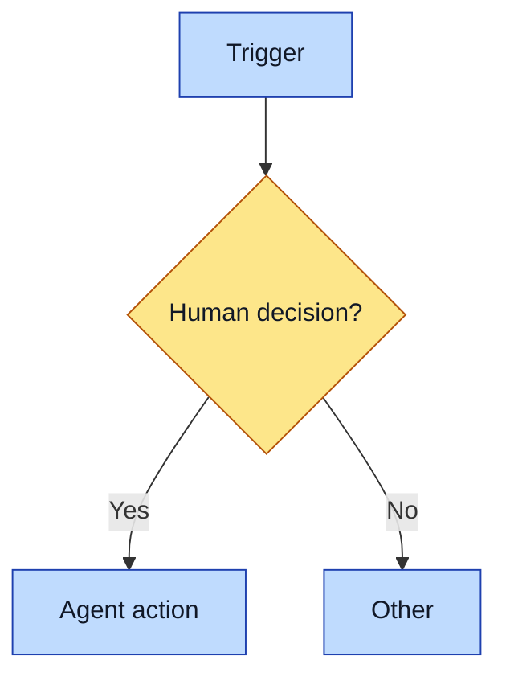

# Purpose
<Why this HDSOP exists and the outcome it produces. One or two sentences.>

# When to use (Trigger)
<The concrete signal that kicks this off. Name the moment.>

# Inputs / Prerequisites
- <Data, sources, access needed. Link reference materials in ./references/.>

# Roles
| Role | Responsibility |
|---|---|
| **Human operator** | <the judgment calls only the operator can make> |
| **Agent executor** | <the repeatable parts a skill/agent handles> |

# Procedure
Steps say WHAT happens. Do not mark who does each step (human vs agent) or add automation notes inline. The flowchart color-codes who; the Automation Opportunities section holds the ROI analysis.

1. <Step: what happens.>
2. <Step. Branch logic belongs here: if <condition>, <action>; else <action>.>

# Process Flowchart
Color-code the actor: amber = irreducibly human, blue = agent-executed or agent-proposed.

# Done / Verification
<What "done" looks like and how to confirm it.>

# Exceptions & Troubleshooting
<Common failure modes and how to handle them.>

# Automation Opportunities
<The dedicated ROI pass: what's already automated, the strongest next candidate, estimated savings, and the irreducibly-human core. When this changes, update the workflow's automation status in COVERAGE.md.>

# Related Skills & HDSOPs
- <links>

# Revision History
| Version | Date | Changes |
|---|---|---|
| 0.1 | YYYY-MM-DD | Initial draft. |
