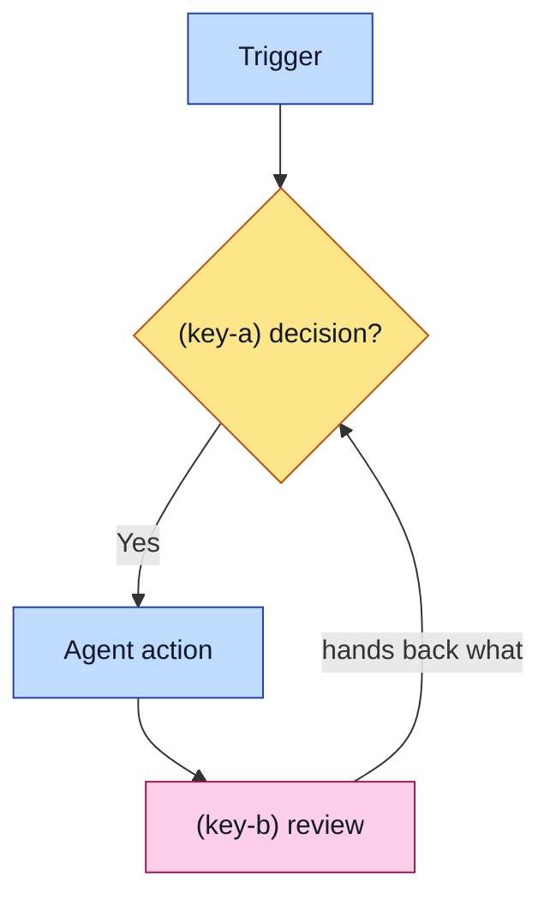

# Purpose
<Why this HDSOP exists and the outcome it produces. One or two sentences.>

# When to use (Trigger)
<The concrete signal that kicks this off. Name the moment.>

# Inputs / Prerequisites
- <Data, sources, access needed. Link reference materials in ./references/.>

# Roles
One row per NAMED human when there is more than one. A generic "Human operator" row in a
multi-human workflow hides the only thing the reader needed, which is whose turn it is.

| Role | Key | Responsibility |
|---|---|---|
| **<Full Name>** | `<short-key>` | <the judgment calls only this person can make> |
| **<Full Name>** | `<short-key>` | <the judgment calls only this person can make> |
| **Agent executor** | `agent` | <the repeatable parts a skill/agent handles> |

# Procedure
Steps say WHAT happens. Do not mark who does each step (human vs agent) or add automation notes inline. The flowchart color-codes who; the Automation Opportunities section holds the ROI analysis.

1. <Step: what happens.>
2. <Step. Branch logic belongs here: if <condition>, <action>; else <action>.>

# Process Flowchart
Color-code the actor: amber = irreducibly human, blue = agent-executed or agent-proposed.

**With one human, use `classDef human` and nothing else.** With more than one, give each named
human their own class in the amber family AND put their key in the node label, because color
alone fails for a colorblind reader and fails completely in a printout. Draw every
human-to-human handoff as its own labelled edge; that is where a multi-human process loses its
time, and a single amber blob cannot show it to you.

```mermaid
flowchart TD
    A[Trigger] --> B{"(key-a) decision?"}
    B -->|Yes| C[Agent action]
    C --> D["(key-b) review"]
    D -->|hands back what| B
    classDef agent fill:#bfdbfe,stroke:#1e40af,color:#111827;
    classDef keya fill:#fde68a,stroke:#b45309,color:#111827;
    classDef keyb fill:#fbcfe8,stroke:#9d174d,color:#111827;
    class A,C agent;
    class B keya;
    class D keyb;
```

# Done / Verification
<What "done" looks like and how to confirm it.>

# Exceptions & Troubleshooting
<Common failure modes and how to handle them.>

# Automation Opportunities
<The dedicated ROI pass: what's already automated, the strongest next candidate, estimated savings, and the irreducibly-human core. When this changes, update the workflow's automation status in COVERAGE.md.>

# Related Skills & HDSOPs
- <links>

# Revision History
| Version | Date | Changes |
|---|---|---|
| 0.1 | YYYY-MM-DD | Initial draft. |
