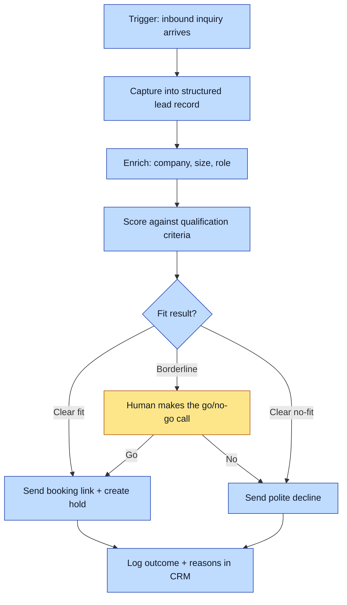

# Purpose
Turn a raw inbound inquiry into either a booked call with a qualified prospect or a logged, politely-declined lead. Protects the team's scarcest resource (selling time) by getting non-fits out of the funnel fast and getting real fits in front of a human quickly. This is a worked example that ships with the template; delete this folder once you have your own workflows.

# When to use (Trigger)
A new inbound inquiry arrives through any channel: website form, email, referral intro, or DM.

# Inputs / Prerequisites
- The raw inquiry (form fields, email body, or message thread).
- The qualification criteria the business uses (budget, timeline, use-case fit, decision authority).
- Access to the CRM and the calendar-booking link.

# Roles
| Role | Responsibility |
|---|---|
| **Human operator** | The go/no-go judgment on borderline leads and any relationship-sensitive reply. |
| **Agent executor** | Capturing the lead, enriching it, scoring it against the criteria, drafting the reply, and logging the outcome. |

# Procedure
Steps say WHAT happens. Who does each step is shown in the flowchart color.

1. Capture the inquiry into a single structured lead record: name, company, channel, stated need, and any contact details.
2. Enrich the record: look up the company and the person, fill in size, industry, and role where the inquiry left them blank.
3. Score the lead against the qualification criteria. Produce a clear fit / borderline / no-fit result with the reasons.
4. If the result is a clear fit, send the booking link and create the calendar hold. If it is a clear no-fit, send the polite decline and log the reason. If it is borderline, route it to the operator with a one-paragraph summary and a recommendation.
5. Record the outcome and the reasons in the CRM so the criteria can be reviewed against what actually converts.

# Process Flowchart

**Amber = irreducibly human** (the borderline go/no-go call). **Blue = agent-executed or agent-proposed** (capture, enrichment, scoring, sending, logging).

# Done / Verification
Every inbound inquiry ends in exactly one of two terminal states within the same day: a booked call with a hold on the calendar, or a logged decline with a reason. No inquiry sits unqualified overnight.

# Exceptions & Troubleshooting
- **The inquiry is too vague to score.** Send one clarifying question before scoring; do not guess fit from nothing.
- **A referral from a key relationship scores as no-fit.** Route to the operator regardless; relationship value can override the raw score, and only a human weighs that.
- **The criteria keep mislabeling leads.** Review the logged outcomes against what actually converted and correct the criteria. The scoring is only as good as the criteria behind it.

# Automation Opportunities
- **Strong first candidates:** capture, enrichment, and scoring. These are rule-based and repeatable, and are the natural first skills to quarry from this map.
- **Then:** drafting the booking reply and the decline, with the operator approving borderline sends until trust is earned.
- **Irreducibly human:** the borderline go/no-go and any relationship-sensitive judgment. That stays a person, forever.

# Related Skills & HDSOPs
- Method: [Documenting a Hyperdocumented SOP](https://truthmanagement.wiki/playbooks/documenting-a-hyperdocumented-sop).

# Revision History
| Version | Date | Changes |
|---|---|---|
| 0.1 | 2026-07-01 | Example shipped with the HDP template. |
